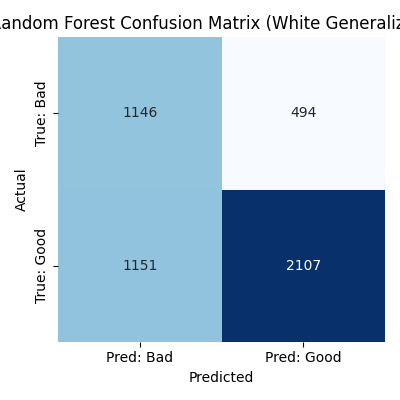
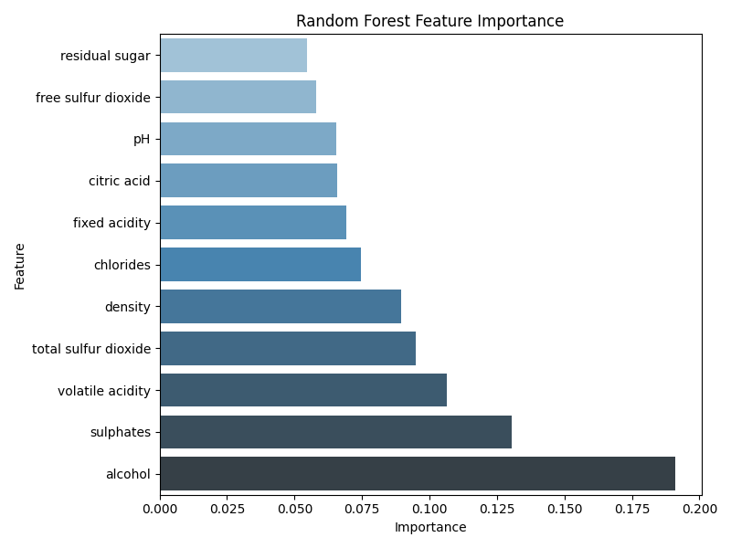
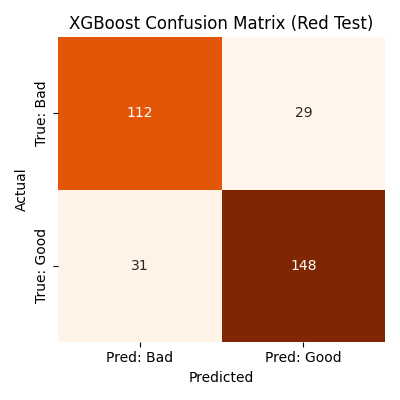
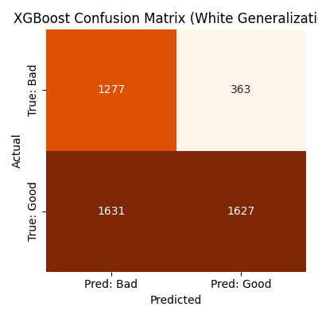
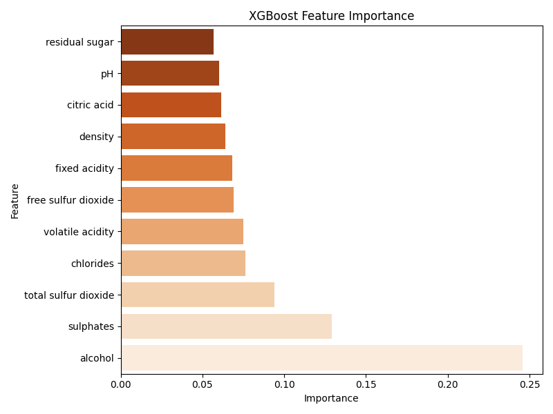

# Title
### Wine Quality Prediction using Machine Learning
# Member
양시영 건설환경공학과 2021042424 kongou1324@gmail.com

# 1. Overview
## 1.1 Red to White Generalization
Red Wine 데이터를 통해 모델을 학습하고, 이를 White Wine 데이터에 적용해 일반화 성능을 평가하는 프로젝트입니다. 와인의 11개의 수치형 화학 성분을 통해 품질을 예측하며, Wine의 종류가 바뀌었을 때 발생하는 domain shift 현상에 대해 분석합니다.

# 2. Dataset
- `winequality-red.csv` (1,599 samples)
- `winequality-white.csv` (4,898 samples)
- Columns: 11개의 수치형 화학 성분 + `quality` (score: 0~10)

# 3. Analysis based on strategy
## 3.1 Random Forest
### 3.1.1 Labeling Strategy
- 원본 'quality' 는 정수 점수(0~10)
- 본 프로젝트에서는 이진 분류로 변환:
  - `quality 6 이상` → **good (1)**
  - `quality 5 이하` → **bad (0)**

### 3.1.2 Baseline model - Random Forest
Red Wine 데이터로 학습 후, 같은 도메인(red) 및 다른 도메인(white)에서 평가를 진행

### 3.1.3 Red Wine Test Results

- Accuracy: 79.4%

### 3.1.4 White Wine Test Results

- Accuracy: 66.4%

### 3.1.5 Feature Importance

### 3.1.6 Overall
- Red Wine의 경우에는 높은 정확도와 안정적인 예측 결과를 보였으나, white wine으로 일반화할 경우에는 66% 수준으로 하락하는 모습을 보임.
- 특히 **bad/good 클래스 간의 구분이 불명확**한 결과가 발생하며, 이는 conclusion matrix에서도 확인됨.
- 주요 원인으로는:
  - **Red/White wine의 feature 분포 차이** (ex: 알코올 도수, 산도 등)
  - alcohol이 가장 중요하다고 학습했지만, white wine에서는 이 특성의 분포가 다를 수 있음.
  - 따라서 **Random Forest는 red wine의 특성에 과적합된 경향**을 보인다고 판단.

- Next Step: Why XGBoost?:
  - Random Forest는 고정된 트리 구조에 기반하여 샘플링 및 다수결 방식으로 예측함 → 도메인 외부 데이터(white wine)에는 민감하게 반응하지 못함.
  - XGBoost는 트리의 잔차를 계속 보완하며 학습하는 boosting 계열 알고리즘으로, 더 섬세한 decision boundary를 학습 가능.
  - 실제로 white wine에 대해 더 나은 일반화 성능을 기대할 수 있으며, 이후 실험에서 이를 비교 분석할 예정.

## 3.2 XGBoost
### 3.2.1 Red Wine Test Results

- Accuracy: 79.1%

### 3.2.2 White Wine Test Results

- Precision:
  - `Good (1)`: 0.837
  - `Bad (0)`: 0.441
- Recall:
  - `Good (1)`: 0.481
  - `Bad (0)`: 0.815

### 3.2.3 Feature Importance

### 3.2.4 Overall
- White Wine의 Generalization에서 **Good을 놓치는 경우가 많고, 반대로 Bad는 잘 맞추는 모습을 보인다**.
- Domain Shift의 영향이 큰 것으로 보임. (white wine의 `Good` 특성을 잘 일반화하지 못함.)

- XGBoost는 **Red Wine 내에서는 강력하지만**, **White Wine의 일반화 성능은 오히려 하락**하는 모습을 보인다.
- 이유로는:
  - 트리의 깊이 및 잔차 보완 학습이 **red 데이터 분포에 과적합**된 결과
  - white wine의 `Good` 클래스 분포가 더 복잡하거나 다르게 구성됨.

