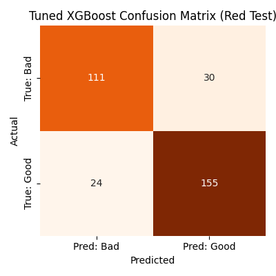
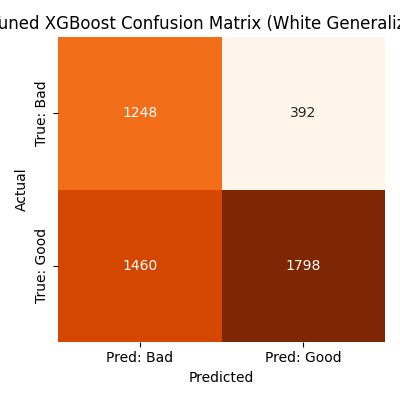
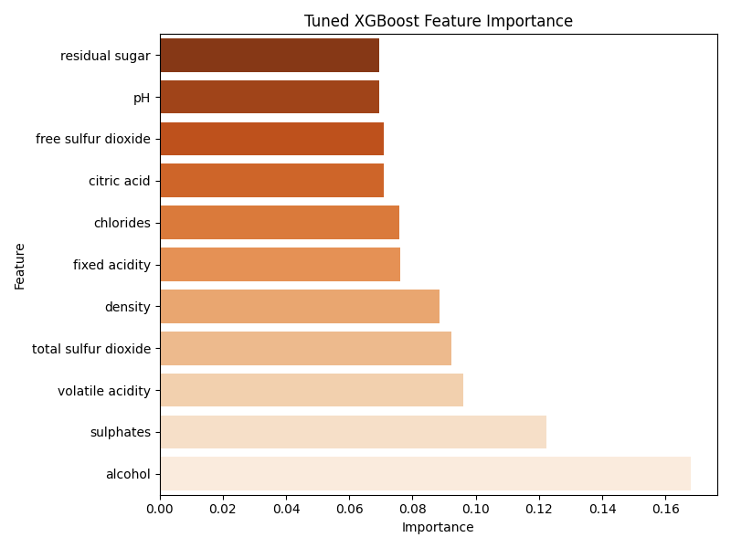

# Title
### Wine Quality Prediction using Machine Learning
# Member
양시영 건설환경공학과 2021042424 kongou1324@gmail.com

# 1. Overview
## 1.1 Background & Objective
와인의 품질은 다양한 화학적 성분에 따라 결정되며, 이를 수치적으로 예측하는 문제는 **정량적 분석 + 머신러닝 응용**을 통해 이루어지고, 이에 대해 많으 연구 결과들이 있다. 본 프로젝트에서는 **Red Wine 데이터만을 활용하여 모델을 학습**하고, **White Wine 데이터에 대한 일반화 성능**을 평가함으로써 **Domain Shift**문제를 다루고자 한다.

## 1.2 Key Focus
- `Binary Classification`: 와인의 품질`quality`을 이진 레이블(Good/Bad)로 전처리하여 분류 문제로 단순화
- `Cross-Domain Generalization`: Red Wine으로 학습한 모델이 White Wine에도 적용 가능한가?
- `Model Comparison`:
  - Baseline: `Random Forest`
  - Advanced: `XGBoost`
- `Model Improvement`:
  - Feature importance 분석
  - 하이퍼파라미터 튜닝 (GridSearchCV)
  - 일반화 성능 향상 시도 및 한계 분석
 
### 1.3 Summary of Findings
- Random Forest는 red wine에서는 더 좋은 성능을 보이지만, white wine에서는 정확도 급락
- XGBoost는 더 섬세한 경계를 학습하나 여전히 도메인 차이를 극복하진 못함.
- 하이피파라미터튜닝을 통해 red wine 정확도는 향상하였으나 white wine 성능 향상은 미미

# 2. Dataset
- `winequality-red.csv` (1,599 samples)
- `winequality-white.csv` (4,898 samples)
- Columns: 11개의 수치형 화학 성분 + `quality` (score: 0~10)

# 3. Analysis based on Theory
## 3.1 Random Forest
### 3.1.1 Labeling Strategy
- 원본 'quality' 는 정수 점수(0~10)
- 본 프로젝트에서는 이진 분류로 변환:
  - `quality 6 이상` → **good (1)**
  - `quality 5 이하` → **bad (0)**

### 3.1.2 Baseline model - Random Forest
Red Wine 데이터로 학습 후, 같은 도메인(red) 및 다른 도메인(white)에서 평가를 진행

### 3.1.3 Red Wine Test Results

- Accuracy: 79.4%

### 3.1.4 White Wine Test Results

- Accuracy: 66.4%

### 3.1.5 Feature Importance

### 3.1.6 Overall
- Red Wine의 경우에는 높은 정확도와 안정적인 예측 결과를 보였으나, white wine으로 일반화할 경우에는 66% 수준으로 하락하는 모습을 보임.
- 특히 **bad/good 클래스 간의 구분이 불명확**한 결과가 발생하며, 이는 conclusion matrix에서도 확인됨.
- 주요 원인으로는:
  - **Red/White wine의 feature 분포 차이** (ex: 알코올 도수, 산도 등)
  - alcohol이 가장 중요하다고 학습했지만, white wine에서는 이 특성의 분포가 다를 수 있음.
  - 따라서 **Random Forest는 red wine의 특성에 과적합된 경향**을 보인다고 판단.

- Next Step: Why XGBoost?:
  - Random Forest는 고정된 트리 구조에 기반하여 샘플링 및 다수결 방식으로 예측함 → 도메인 외부 데이터(white wine)에는 민감하게 반응하지 못함.
  - XGBoost는 트리의 잔차를 계속 보완하며 학습하는 boosting 계열 알고리즘으로, 더 섬세한 decision boundary를 학습 가능.
  - 실제로 white wine에 대해 더 나은 일반화 성능을 기대할 수 있으며, 이후 실험에서 이를 비교 분석할 예정.

## 3.2 XGBoost
### 3.2.1 Red Wine Test Results

- Accuracy: 79.1%

### 3.2.2 White Wine Test Results

- Precision:
  - `Good (1)`: 0.837
  - `Bad (0)`: 0.441
- Recall:
  - `Good (1)`: 0.481
  - `Bad (0)`: 0.815

### 3.2.3 Feature Importance

### 3.2.4 Overall
- White Wine의 Generalization에서 **Good을 놓치는 경우가 많고, 반대로 Bad는 잘 맞추는 모습을 보인다**.
- Domain Shift의 영향이 큰 것으로 보임. (white wine의 `Good` 특성을 잘 일반화하지 못함.)

- XGBoost는 **Red Wine 내에서는 강력하지만**, **White Wine의 일반화 성능은 오히려 하락**하는 모습을 보인다.
- 이유로는:
  - 트리의 깊이 및 잔차 보완 학습이 **red 데이터 분포에 과적합**된 결과
  - white wine의 `Good` 클래스 분포가 더 복잡하거나 다르게 구성됨.

# 4. Hyperparameter Tuning
## 4.1 Motivation
- 기존 Random Forest 및 기본 XGBoost 모델은 red wine 데이터에서는 높은 성능을 보였으나, white wine으로 일반화할 경우 정확도가 **66~67%** 에 머무르는 한계를 보였다.
- 이를 극복하고자 XGBoost에 대하여 하이피파라미터 튜닝을 진행.

## 4.2 Tuning Details
- 사용 기법: `GridSearchCV` (5-fold cross validation)
- 주요 튜닝 파라미터:
  - `n_estimators`: [100, 200, 300]
  - `max_depths`: [3, 5, 7]
  - `learning_rate`: [0.05, 0.1, 0.2]

## 4.3 Evaluations
### 4.3.1 Red Wine

- Accuracy: 80.4%
- Precision(Good): 81.3%
- Recall(Good): 83.6% → 기존 XGBoost 대비 **정확도 +1.3%**, 특히 Good 클래스에 대한 **Recall이 크게 향상됨**.

### 4.3.2 White Wine

- Accuracy: 66.9%
- Precision: 83.2%
- Recall: 48.5% → White Wine에 대한 **정확도는 비슷**, 다만 **Precision은 증가**, Recall은 소폭 하락. 여전히 **Domain shift**로 인한 **일반화의 어려움**이 존재.

### 4.3.3 Feature Importance

- 튜닝된 모델에서도 `alcohol`이 가장 중요한 변수로 선정
- 그 외 `volatile acidity`, `density` 등이 중요하게 학습됨

## 4.4 Summary
- 하이퍼파라미터 튜닝을 통해 red wine에서의 성능은 **의미 있게 향상**
- 하지만 white wine 일반화에는 **제한적인 효과** → 분포 차이 영향은 여전함.

# 5. Conclusion
- 본 프로젝트는 **Red Wine 데이터로 학습한 모델을 White Wine에 적용**하는 방식으로, 머신러닝 모델의 **도메인 일반화 성능**을 평가하였다.
- `Random Forest`, `XGBoost` 모두 Red Wine에서는 높은 정확도를 보였으나, White Wine으로 일반화할 경우에 성능 저하가 발생하였다.
- 특히, 두 와인의 **화학적 특성 분포 차이**로 인해 Good/Bad 클래스 간 경계가 모델 간 다르게 학습되며 일반화에 한계가 있었다.
- `XGBoost` 모델에 대해 하이퍼파라미터 튜닝을 진행한 결과 Red Wine에서는 의미 있는 성능 향상이 있었으나, White Wine에 대한 일반화에는 제한적인 효과만을 보였다.
- 따라서 **단일 도메인에서의 성능만으로 모델을 일반화 가능하다고 보기에는 어렵고**, 추후에는:
  - `Red + White 데이터 통합 학습`
  - `Domain Adaptation 기법 (ex. Transfer Learning)`
  - `앙상블 기법`
    등의 추가 연구가 필요함을 시사한다.

# 6. Citation
- - P. Cortez, A. Cerdeira, F. Almeida, T. Matos and J. Reis, "Modeling wine preferences by data mining from physicochemical properties", *Decision Support Systems*, Elsevier, 47(4):547-553, 2009.
- Dataset available at: [UCI Machine Learning Repository - Wine Quality](https://archive.ics.uci.edu/ml/datasets/Wine+Quality)
